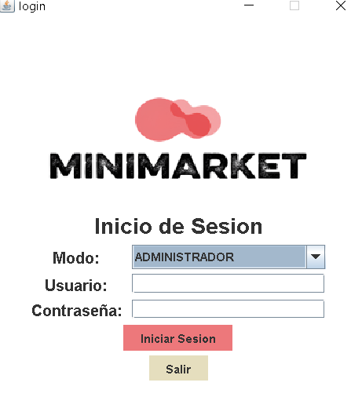

#Proyecto Final de Programacion
#link del video: https://youtu.be/7K0V4yysxbI

#Minmarket

El presente proyecto tiene como objetivo desarrollar un sistema de gestión integral para un minimarket utilizando los principios de la Programación Orientada a Objetos (POO). 

