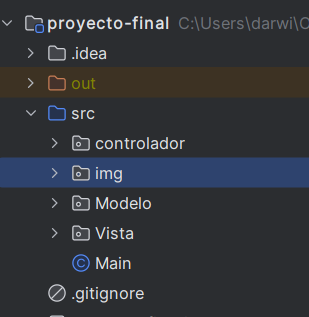
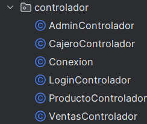
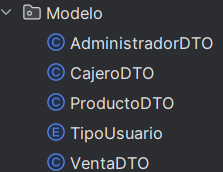
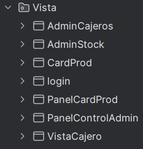
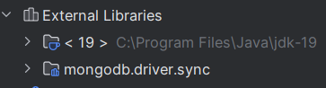
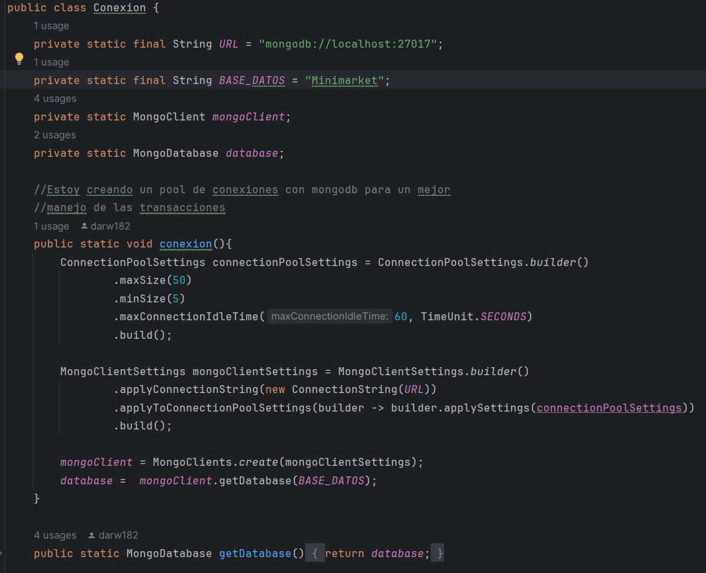
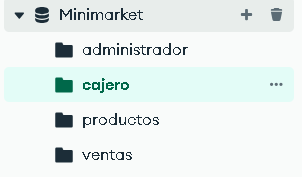
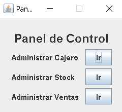
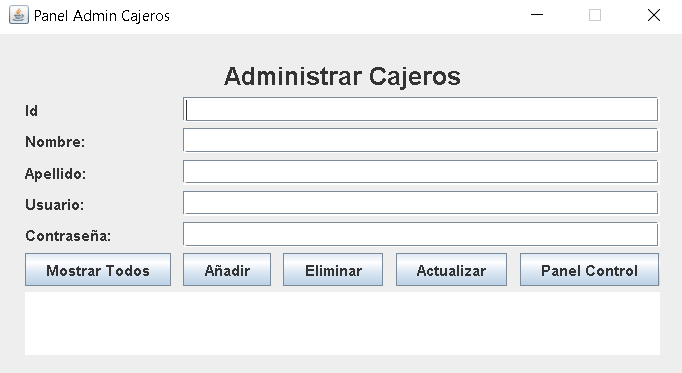
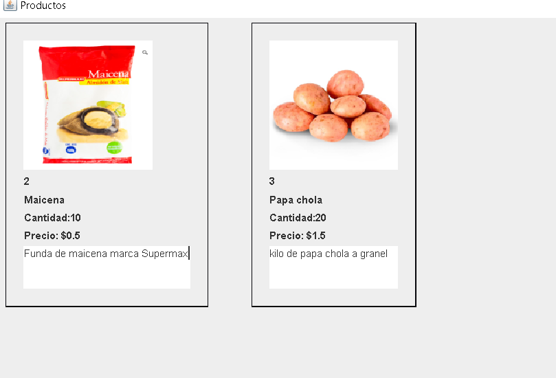

#Proyecto Final de Programacion

#link del video: https://youtu.be/7K0V4yysxbI

#Minmarket

El presente proyecto tiene como objetivo desarrollar un sistema de gestión integral para un minimarket utilizando los principios de la Programación Orientada a Objetos (POO). 

##objeitvo

Crear un software que me pemita la automatización de tareas rutinarias como el registro de productos, control de inventario, procesamiento de ventas y generación de reportes.

##Conformacion del proyecto

Para este proyecto se use el patron modelo-vista-controlador porque nos permite mantener un mejor orden de las clases, pero principalmente este modelo nos permite poner en practica todo lo relacinado a la programacion orientada a objetos como el encapsulamiento, instanciacion, herencia, etc.

Aqui muestro la estructura del proyecto:

Estructura del controlador:

Estructura del modelo:

Estructura de la vista:

Aqui se muestran las librerias usadas en este proyecto

##Conexion

Se uso mongoDB una base de datos no sql para almacenar los datos generados en el proyecto. Se uso un pool de Conexiones para administrar de mejor manera cada una de las transacciones; mongodb cuenta con su propio pool a diferencia de las bases de datos sql en la cuales es necesario incorporar la libreria externa de apache. 

Estas son las colecciones en mongoDb:

##Vistas del proyecto

Login:

Panel de control:

Panel de administracion de cajeros:

Panel de administracion de stock:

Pantalla de stock:

