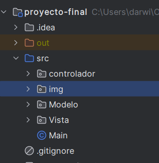
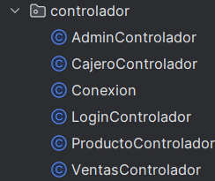
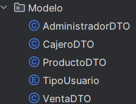
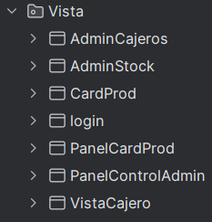
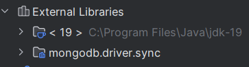
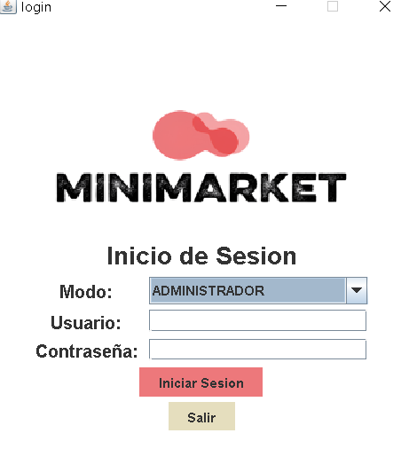

#Proyecto Final de Programacion
#link del video: https://youtu.be/7K0V4yysxbI

#Minmarket

El presente proyecto tiene como objetivo desarrollar un sistema de gestión integral para un minimarket utilizando los principios de la Programación Orientada a Objetos (POO). 

##objeitvo

Crear un software que me pemita la automatización de tareas rutinarias como el registro de productos, control de inventario, procesamiento de ventas y generación de reportes.

##Conformacion del proyecto

Para este proyecto se use el patron modelo-vista-controlador porque nos permite mantener un mejor orden de las clases, pero principalmente este modelo nos permite poner en practica todo lo relacinado a la programacion orientada a objetos como el encapsulamiento, instanciacion, herencia, etc.

Aqui muestro la estructura del proyecto:

Estructura del controlador:

Estructura del modelo:

Estructura de la vista:

Aqui se muestran las librerias usadas en este proyecto

